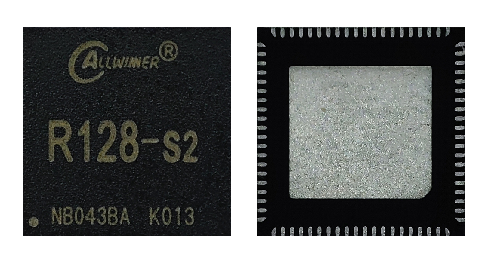

# 简介

R128是一颗专为“音视频解码”而打造的全新高集成度 SoC，主要应用于智能物联和专用语音交互处理解决方案。

- 单片集成 MCU+RISCV+DSP+CODEC+WIFI/BT+PMU，提供生态配套成熟、完善的用于系统、应用和网络连接开发的高效算力；
- 集成 8MB/16MB/32MB PSRAM，为音视频解码、大容量存储、扫码以及网络连接提供充裕的高容量、高带宽的内存支持；
- 拥有丰富的音频接口 IIS/PCM、OWA、DMIC、LINEOUT、MICIN 以及通用通讯接口 IIC、UART、SDIO、 SPI、ISO7816卡接口；同时支持 U 盘、SD卡、IR-TX/RX；
- 内置 LDO、GPADC、LEDC，简化系统方案设计，降低 BOM成本。

!> 文档目前正在施工，敬请期待

## 芯片应用场景

## 芯片实物图

## 芯片框图

## 关于本文档

本文档为 R128 开放文档，包括芯片简述，环境搭建，快速入门，SDK手册等内容，方便快速掌握 R128 开发。

在线文档地址：https://yuzukihd.top/R128Module/

PDF文档下载：https://github.com/YuzukiHD/R128Module/releases

请注意，PDF文档并不是最新的，网页文档滚动更新可能不会及时同步PDF

| 文档   | 版本  |
| ------ | ----- |
| 网页端 | 0.4.8 |
| PDF    | 0.4.8 |

## 文档约定

### 地址与数据描述方法约定

本文档在描述地址、数据时遵循如下约定：

| 符号 | 例子                | 说明                                                         |
| ---- | ------------------- | ------------------------------------------------------------ |
| 0x   | 0x0200，0x79        | 地址或数据以16 进制表示。                                    |
| 0b   | 0b010，0b00 000 111 | 数据采用二进制表示(寄存器描述除外)。                         |
| X    | 00X，XX1            | 数据描述中，X 代表0 或1。 例如：00X 代表000 或 001；XX1 代表001，011，101 或111。 |

### 数值单位约定

本文档在描述数据容量（如NAND 容量）时，单位词头代表的是1024 的倍数；描述频率、数据
速率等时则代表的是1000 的倍数。具体如下：

| 类型                     | 符号 | 对应数值      |
| ------------------------ | ---- | ------------- |
| 数据容量（如 NAND 容量） | 1 K  | 1024          |
|                          | 1 M  | 1 048 576     |
|                          | 1 G  | 1 073 741 824 |
| 频率，数据速率等         | 1 K  | 1000          |
|                          | 1 M  | 1 000 000     |
|                          | 1 G  | 1 000 000 000 |

