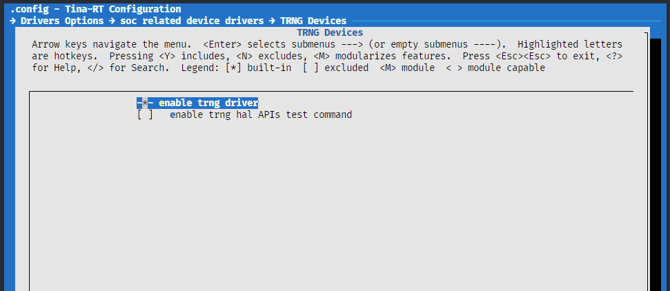
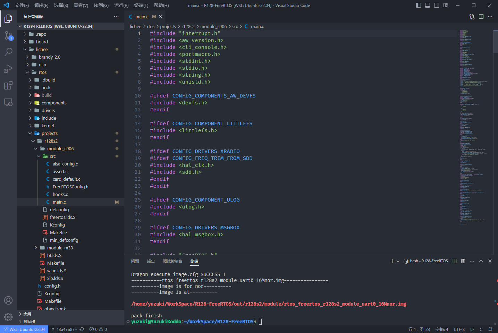
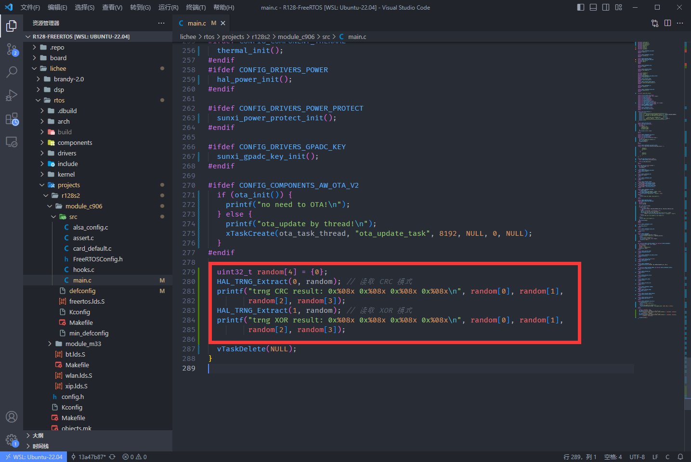

# 获取真随机数

R128 内置了TRNG，一个真随机数发生器，随机源是 8 路独立的环形振荡器，由模拟器件电源噪声产生频率抖动，用低频始终重采样，然后进行弹性抽取和熵提取处理，最终输出128bit真随机数。

## 载入方案

我们使用的开发板是 R128-Devkit，需要开发 C906 核心的应用程序，所以载入方案选择`r128s2_module_c906`

```bash
$ source envsetup.sh 
$ lunch_rtos 1
```


## 设置 TRNG驱动

运行 `mrtos_menuconfig` 进入配置页面。前往下列地址找到 `TRNG Devices` 

```
Kernel Setup --->
    Drivers Setup --->
        SoC HAL Drivers --->
        	TRNG Devices --->
        	-*- enable trng driver
```




## 编写程序

打开你喜欢的编辑器，修改文件：`lichee/rtos/projects/r128s2/module_c906/src/main.c`



### 引入头文件

```c
#include <sunxi_hal_trng.h>
```


## 初始化 TRNG 读取数据模块



```c
uint32_t random[4] = {0};

HAL_TRNG_Extract(0, random); // 读取 CRC 模式
printf("trng CRC result: 0x%08x 0x%08x 0x%08x 0x%08x\n", random[0], random[1], random[2], random[3]);

HAL_TRNG_Extract(1, random); // 读取 XOR 模式
printf("trng XOR result: 0x%08x 0x%08x 0x%08x 0x%08x\n", random[0], random[1], random[2], random[3]);
```

## 结果

编译固件后烧录，可以看到随机数输出。

