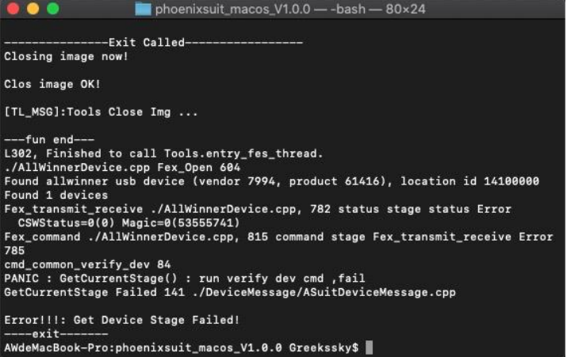

# 刷写固件

编译系统源码后，打包后生成的系统文件称之为固件。固件一般为`.img`格式。把固件下载到开发板或者产品上的过程称之为**烧写固件**。

## 烧录模式

R128 有两种烧录模式，分别为 USB 烧录与UART烧录。烧录模式以芯片 RST 时 PA1，PA2 引脚高低电平控制。

| PA1  | PA2  | 模式      |
| ---- | ---- | --------- |
| 1    | 1    | 非法模式  |
| 1    | 0    | 正常启动  |
| 0    | 1    | UART 下载 |
| 0    | 0    | USB 下载  |

## USB 烧写

R128 支持使用 USB 烧写系统。对于 Windows 用户可以使用 PhoenixSuit 进行烧写。是最常用的烧写工具，通过数据线将PC和开发板连接，把固件烧到开发板上。PhoenixSuit 支持分区烧写，适用于开发和小规模生产使用。

### PhoenixSuit - Windows

1. 打开PhoenixSuit，当设备上电启动并插入USB与PC相连的时，PhoenixSuit会提示识别到设备
2. 点击 `一键刷机-浏览` 选择要烧写的固件
3. 点击 `立即升级`，此时会通过USB给设备发送重启命令，设备会带着烧写标识重启，并在重启阶段进入烧写模式
4. 设备重新到 boot 的时候会自动进行烧写，可以看到 PhoenixSuit 的烧写进度
5. 烧写成功，设备重启

### PhoenixSuit - Linux

Linux 版本 PhoenixSuit 支持的发行版本包括 Ubuntu、Fedora、Redhat 及 CentOS 等几个常见的发行版本。目前驱动已经可以支持 4.11.0 版本以上内核，建议安装内核版本号大于4.11.0 的 Linux 发行版本。

#### 安装 PhoenixSuit - Linux

1. 二进制可执行文件为 PhoenixSuit.run。如果该文件没有执行权限，请在终端下使用命令：`chmod +x PhoenixSuit.run` 为该文件添加可执行权限
2. 打开终端，输入 `sudo ./PhoenixSuit.run` 来运行安装程序。如果提示缺少 dkms 模块，Ubuntu 用户请使用命令：`sudo apt-get install dkms` 安装，其他发行版本用户请使用 `yum install` 或者网络下载对应自己版本的 dkms 安装。
3. 程序安装在当前用户 Home 目录的 Bin 目录下面。
4. 安装完程序，进入程序目录输入命令 `sudo ./PhoenixSuit` 运行 PhoenixSuit。

#### 烧录

1. 使用命令 `sudo ./PhoenixSuit rtos_xxx_uart0_16Mnor.img ` 下载烧录 `rtos_xxx_uart0_16Mnor.img`
2. 设备重新到 boot 的时候会自动进行烧写

### PhoenixSuit - MacOS

1. 下载解压 `PhoneixSuit_MacOS.zip` 
2. 在 Mac 电脑中进入终端，将目录切到工具目录下
3. 执行命令 `chmod 777 ./phoenixsuit` 赋予运行权限
4. 使用命令 `./phoenixsuit rtos_xxx_uart0_16Mnor.img ` 下载烧录 `rtos_xxx_uart0_16Mnor.img`
5. 设备重新到 boot 的时候会自动进行烧写
6. 烧写成功，设备重启

### USB 烧写的流程

R128 系统的烧写流程如下：

1. 片内引导 BROM 初始化芯片，识别到 PA1，PA2 脚为 USB 烧录模式，初始化 USB
2. 上位机通过 USB 烧写 BOOT0 到 SRAM 中，并运行 BOOT0
3. BOOT0 初始化 PSRAM，返回完成信号等待上位机下载 BOOT1（U-Boot）
4. 上位机收到信号，下载 BOOT1（U-Boot）到 PSRAM 中，并引导运行 BOOT1（U-Boot）
5. BOOT1（U-Boot） 初始化系统资源，初始化内部 SPI NOR，USB2.0 等资源，等待上位机下载
6. 上位机下发固件，进入烧写模式

## UART 烧写

R128 支持使用 UART 烧写系统。不过由于烧录速率较慢（正常烧写16M固件需要10分钟以上），这里不做过多说明。仅给出通讯协议方便定制开发。

| Host | Main-CMD | Sub-CMD | CMD Value | Description              | Remarks                                        |
| ---- | -------- | ------- | --------- | ------------------------ | ---------------------------------------------- |
| PC   | 0x00     | 0x00    | 0x00      | Read 1 byte              |                                                |
| PC   | 0x00     | 0x01    | 0x01      | Write 1 byte             |                                                |
| PC   | 0x00     | 0x02    | 0x02      | Read 2 bytes             |                                                |
| PC   | 0x00     | 0x03    | 0x03      | Write 2 bytes            |                                                |
| PC   | 0x00     | 0x04    | 0x04      | Read 4 bytes             |                                                |
| PC   | 0x00     | 0x05    | 0x05      | Write 4 bytes            |                                                |
| PC   | 0x00     | 0x06    | 0x06      | Read 8 bytes             |                                                |
| PC   | 0x00     | 0x07    | 0x07      | Write 8 bytes            |                                                |
| PC   | 0x01     | 0x00    | 0x08      | Read n bytes             |                                                |
| PC   | 0x01     | 0x01    | 0x09      | Write n bytes            |                                                |
| PC   | 0x02     | 0x00    | 0x10      |                          | Change the UART transmission condition         |
| PC   | 0x02     | 0x01    | 0x11      |                          | Enable/Disable JTAG                            |
| PC   | 0x02     | 0x02    | 0x12      |                          | reboot                                         |
| PC   | 0x02     | 0x03    | 0x13      | Set PC pointer           |                                                |
| PC   | 0x02     | 0x04    | 0x14      |                          | Enable/disable MCU transmission and validation |
| PC   | 0x02     | 0x05    | 0x15      |                          | Obtain baud rate list                          |
| PC   | 0x02     | 0x06    | 0x16      |                          | Modify the buffer                              |
| PC   | 0x00     | 0x00    | 0x18      | Obtain flash information |                                                |
| PC   | 0x01     | 0x01    | 0x19      | Chip erase               |                                                |
| PC   | 0x01     | 0x02    | 0x1A      | Read n sectors           |                                                |
| PC   | 0x01     | 0x03    | 0x1B      | Write n sectors          |                                                |
| PC   | 0x01     | 0x04    | 0x1C      | Obtain flash information |                                                |
| PC   | 0x01     | 0x05    | 0x1D      | Chip erase               |                                                |
| PC   | 0x01     | 0x06    | 0x1E      | Read n sectors           |                                                |
| PC   | 0x01     | 0x07    | 0x1F      | Write n sectors          |                                                |
| MCU  | 0x00     | 0x00    |           |                          | Send message to PC                             |

