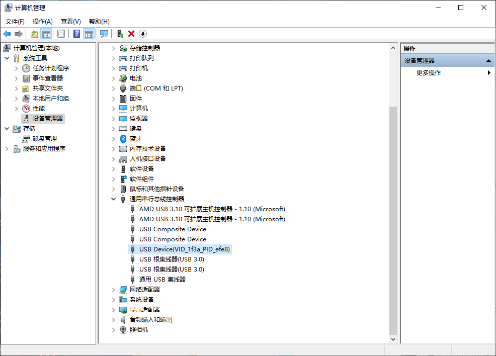
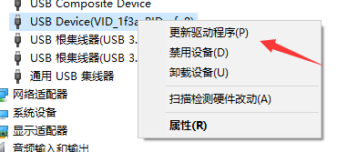
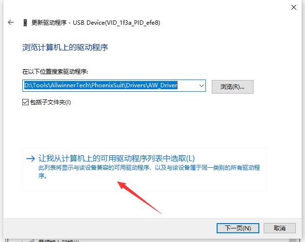
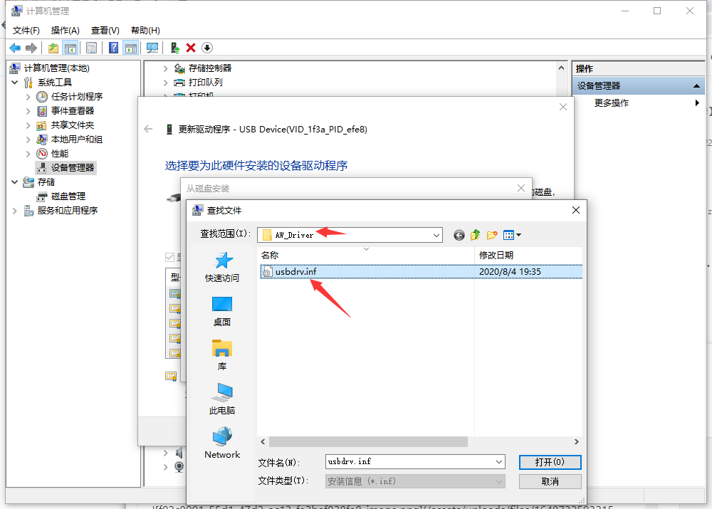
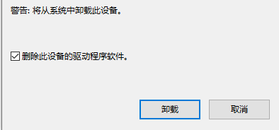

# 开发环境搭建

系统需求：

- 需要 x64 位处理器和操作系统
- 操作系统: Windows 7 以上，WSL2，Docker，Linux (必须为64bit)
- 处理器: Intel Pentium Processor E2160
- 内存: 2 GB RAM

## Windows 开发环境搭建


## Linux 开发环境搭建

这里以常用的几款 Linux 发行版作为示例，搭建开发环境：

### Ubuntu 22.04 / 20.04

1. 更新软件源，更新系统软件包

```shell
sudo apt-get update
sudo apt-get upgrade -y
```

2. 安装开发依赖

```shell
sudo apt-get install build-essential subversion git libncurses5-dev zlib1g-dev gawk flex bison quilt libssl-dev xsltproc libxml-parser-perl mercurial bzr ecj cvs unzip lsof 
```

3. 安装相关工具

```shell
sudo apt-get install kconfig-frontends android-tools-mkbootimg python2 libpython3-dev 
```

4. 增加架构支持

```shell
sudo dpkg --add-architecture i386
sudo apt-get update
```

5. 安装支持包

```shell
sudo apt install gcc-multilib 
sudo apt install libc6:i386 libstdc++6:i386 lib32z1
```

### Ubuntu 18.04
1. 更新软件源，更新系统软件包

```shell
sudo apt-get update
sudo apt-get upgrade -y
```

2. 安装开发依赖

```shell
sudo apt-get install build-essential subversion git libncurses5-dev zlib1g-dev gawk flex bison quilt libssl-dev xsltproc libxml-parser-perl mercurial bzr ecj cvs unzip lsof 
```

3. 安装相关工具

```shell
sudo apt-get install android-tools-mkbootimg libpython3-dev 
```

4. 增加架构支持

```shell
sudo dpkg --add-architecture i386
sudo apt-get update
```

5. 安装支持包

```shell
sudo apt install gcc-multilib 
sudo apt install libc6:i386 libstdc++6:i386 lib32z1
```

### Arch Linux / Manjaro

1. 更新软件源，更新系统软件包

```shell
pacman -Syyuu
```

2. 安装开发依赖

```shell
pacman -S --needed base-devel autoconf automake bash binutils bison bzip2 fakeroot file findutils flex gawk gcc gettext git grep groff gzip time unzip util-linux wget which zlib asciidoc help2man intltool perl-extutils-makemaker swig 
```

3. 安装相关工具

```shell
pacman -S --needed libelf libtool libxslt m4 make ncurses openssl patch pkgconf python rsync sed texinfo
```

4. 增加架构支持

```shell
pacman -S --needed multilib-devel
```

### CentOS / Fedora / openEuler

```shell
sudo dnf --setopt install_weak_deps=False --skip-broken install bash-completion bzip2 gcc gcc-c++ git make ncurses-devel patch rsync tar unzip wget which diffutils python2 python3 perl-base perl-Data-Dumper perl-File-Compare perl-File-Copy perl-FindBin perl-Thread-Queue glibc.i686
```

### openSUSE

```shell
sudo zypper install --no-recommends asciidoc bash bc binutils bzip2 fastjar flex gawk gcc gcc-c++ gettext-tools git git-core intltool libopenssl-devel libxslt-tools make mercurial ncurses-devel patch perl-ExtUtils-MakeMaker python-devel rsync sdcc unzip util-linux wget zlib-devel glibc-devel-32bit
```

## Docker 搭建开发环境


## 驱动安装

### Windows 驱动安装

Windows 驱动下载地址：[https://www.aw-ol.com/downloads/resources/15](https://www.aw-ol.com/downloads/resources/15)

1. 下载后解压 `UsbDriver` 到任意文件夹


2. 右键此电脑，管理


3. 链接待烧录的设备，并使设备进入下载模式，找到资源管理器里的`USB Device(VID_1f3a_PID_efe8)`



4. 右键，更新驱动程序



5. 浏览我的电脑查找


6. 让我从计算机上的可用驱动列表中选取



7. 从磁盘安装


8. 浏览


9. 选择刚才解压出来的文件夹中的`usbdrv.inf` 文件



10. 确定


11. 下一页


12. 安装完成，关闭窗口


#### Windows 驱动常见问题

- 问题：

出现两个 USB Devices


解决方法：

- 右键卸载设备
- 勾选卸载驱动程序



- 重新安装一遍
