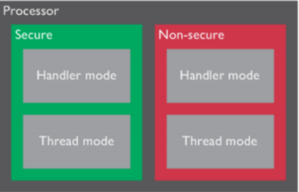
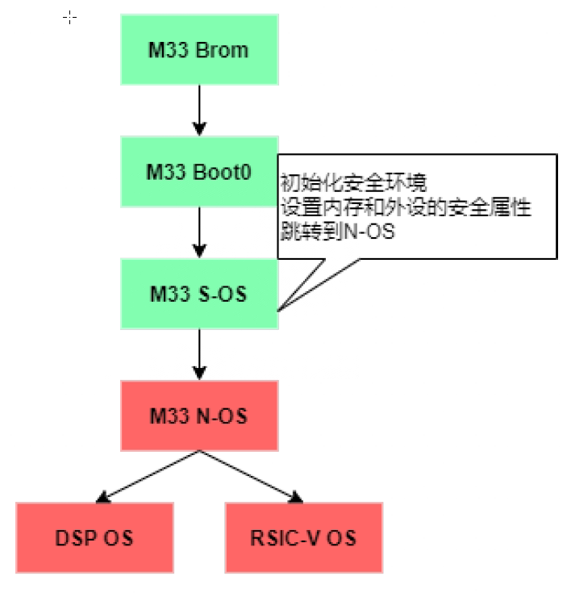
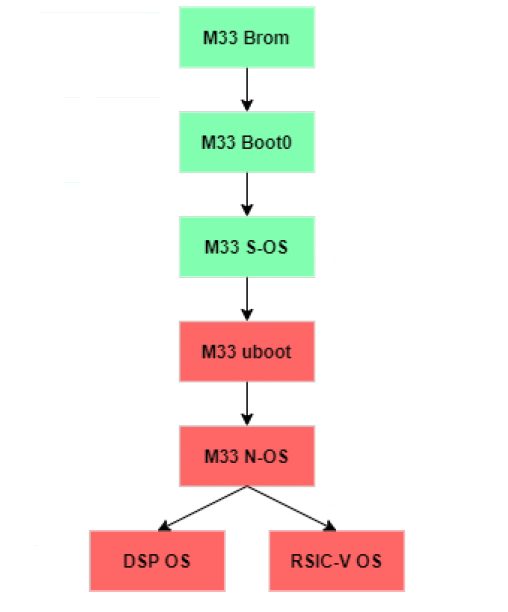
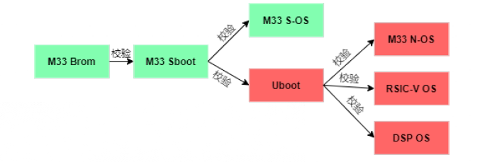
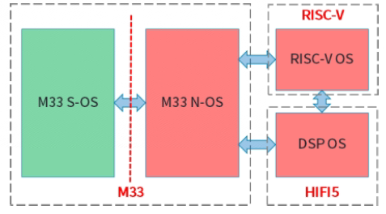
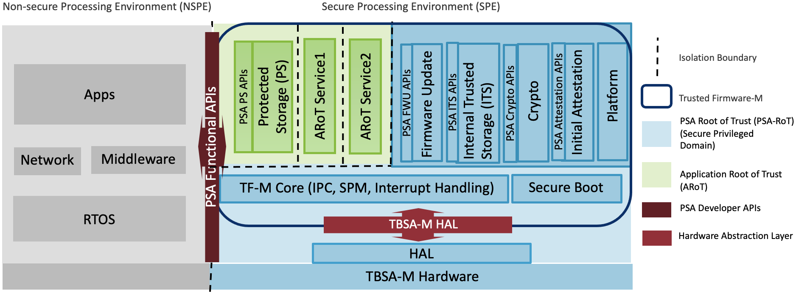

# RTOS 安全

介绍 R128 下安全方案的功能。安全完整的方案基于标准方案扩展，覆盖硬件安全、硬件加解密引擎、安全启动、安全系统、安全存储等方面。

## 配置文件相关

本文涉及到一些配置文件，在此进行说明。

env*.cfg配置文件路径：

```
board/<chip>/<board>/configs/env*.cfg
```

sys_config.fex路径：

```
board/<chip>/<board>/configs/sys_config.fex
```

image_header.cfg路径：

```
board/<chip>/<board>/configs/image_header.template.cfg
```

sys_partition*.fex路径：

```
board/<chip>/<board>/configs/sys_partition.fex
```

## 功能介绍

R128 FreeRTOS 系统上支持如下安全功能


## 安全硬件

下图是 ARM 为 Cortex‑M33 提供的一种基于 TrustZone 的 SoC 架构参考实现


当 CPU 取指或者访问数据时，经过 SAU 与 IDAU 审查之后，携带安全属性，进入 AHB 总线。

由于 SAU/IDAU 机制只适用于 Cortex‑M33 处理器，那么 AHB 设备使用下列两种方法识别与应答这些携带安全属性的访问

1. 第一种是外设在设计时就可以识别安全属性；
2. 第二种需要借助其他控制器来实现，比如上图中的 PPC。开发人员设置 PPC 为不同的外设设置不同的访问规则。同理 MPC 则是用于设置存储器区域的安全属性。

R128 上有些外设可以识别安全属性，比如 CE、DMA 等。大部分外设需要借助 SPC 来配置其安全属性。其中的 PPC 对应 R128 上的 SPC，MPC 对应 R128 上的 SMC，TZMA

###  Cortex‑M33 TrustZone 简介

Cortex‑M33 TrustZone 与 Cortex‑A 系列的 TrustZone 类似，在设计上，处理器都具有安全与非安全状态，非安全软件只能访问非安全内存。与 Cortex‑A 处理器中的 TrustZone 技术不同，Cortex‑M33 的 Secure 和 Normal 世界是基于内存映射的，转换在异常处理中自动发生。



### 安全扩展功能

除了 ARM TrustZone 安全扩展功能外，R128 在 SoC 设计上还实现了一些安全硬件来保障完整的安全特性。

- SMC

SMC 配置 hspsram 存储区域的安全属性，只有在安全环境才可以使用该模块。

- TZMA

TZMA 用于配置 lspsram、sram、spi flash、dsp sram、csi&vad sram 地址空间的安全属性。

| 模块         | 大小  |
| ------------ | ----- |
| TZMA0        | 128KB |
| TZMA1        | 128KB |
| TZMA2        | 256KB |
| TZMA3        | 256KB |
| DSP_TZMA0    | 256KB |
| EXPSRAM_TZMA | 64KB  |
| LPSRAM_TZMA  | 8MB   |
| FLASH_TZMA   | 192MB |

- SPC

SPC 配置外设的安全属性，只有在安全环境才可以使用该模块

- CE

CE 是 AW SoC 的硬件加解密引擎，支持 AES/SHA/RSA 等算法。

- TRNG

TRNG 是真随机数发生器，随机源是 8 路独立的唤醒振荡器，由模拟器件电源噪声产生频率抖动，用低频时钟重采样，然后进行弹性抽取和熵提取处理，最终输出 128bit 真随机数。

- SID/efuse

efuse：一次性可编程熔丝技术，是一种 OTP（One‑Time Programmable，一次性可编程）存储器。efuse 内部数据只能从 0 变成 1，不能从 1 变成 0，只能写入一次。

Secure ID，控制 efuse 的访问。efuse 的访问只能通过 sid 模块进行。sid 本身非安全，安全非安全均可访问。但通过 sid 访问 efuse 时，安全的 efuse 只有安全世界才可以访问，非安全世界访问的结果为 0。

- Flash Encryption

Flash Encryption 模块向 Flash 写数据时计算 AES 进行加密，从 Flash 读出数据时进行解密。支持在 SBUS 读写数据和 CBUS 读操作时进行 AES 实时加解密。仅 Nor Flash 支持。

- Secure Timer and Watchdog

支持一套安全 Timer 与一套安全 Watchdog

## 硬件加解密引擎

CE：Crypto Engine，是 AW SoC 中一个硬件加解密模块，支持多种对称、非对称、摘要生成算法。包含安全/非安全两套接口。

CE 驱动支持算法如下，但 CE 硬件加密模块支持的加密算法不仅限下列算法。

| 算法                 | 支持 |
| -------------------- | ---- |
| AES‑ECB‑128/192/256  | √    |
| AES‑CBC‑128/192/256  | √    |
| AES‑CTR‑128/192/256  | √    |
| AES‑OFB‑128/192/256  | √    |
| AES‑CFB8‑128/192/256 | √    |
| HASH‑MD5             | √    |
| HASH‑SHA1            | √    |
| HASH‑SHA224          | √    |
| HASH‑SHA256          | √    |
| HASH‑SHA384          | √    |
| HASH‑SHA512          | √    |
| RSA‑512              | √    |
| RSA‑1024             | √    |
| RSA‑2048             | √    |

CE具体接口可以在 [CE | R128 Documents](https://yuzukihd.top/R128Module/#/sdk_module/ce) 找到，TRNG可以在 [TRNG | R128 Documents](https://yuzukihd.top/R128Module/#/sdk_module/trng) 找到，这里不过多赘述。

## 安全启动

### 安全固件构建

安全固件与非安全固件打包过程、封装格式类似，仅在原本非安全打包方式基础上，对每个镜像加入签名信息。

```
source envsetup.sh
lunch_rtos R128_xxx_m33
mrtos clean
mrtos_menuconfig # 开启CONFIG_COMPONENTS_TFM。注：非安全固件需关闭
mrtos
createkeys # 创建签名密钥，无需每次执行
pack ‑s # 打包安全固件
```

pack ‑s 打包完成后，生成安全固件，固件位于 out 目录下，文件名为`rtos_freertos_{BOARD}_uart0_secure_[8|16]Mnor_v[NUM].img`。其中 v[NUM] 表示固件的版本信息，NUM 为版本号，由安全固件版本号（见4.7 节）决定。

在首次进行安全固件打包之前，必须运行一次 createkeys 创建自己的签名密钥，并将创建的秘钥妥善保存。每次执行 createkeys 后都会生成新的密钥，因此不用每次都执行，除非需要更换密钥。

### 安全固件配置

打包生成安全固件前，需确保 TFM 打开，在 M33 核执行 mrtos menuconfig 进入配置主界面，进行如下配置：

```
System components ‑‑‑>
    aw components ‑‑‑>
        TFM Support ‑‑‑>
            [*] TFM support
```

!> 只有安全固件需要开始 TFM，非安全固件需要关闭，且仅有 M33 支持 TFM。

### 启动流程

R128 包含三个处理器，分别为 M33（ARM）、C906（RISC‑V）、HIFI5（DSP），仅 M33 支持安全隔离。

从安全性考虑，Brom 启动时，系统必须处于安全状态，因此，选择 M33 作为启动核。

R128 对于 nor 和 nand 方案采用不同的启动流程。对于 nor 方案，安全启动流程如下图所示。启动过程没有 uboot，由 boot0 直接启动安全和非安全 OS，其中 brom、boot0、S‑OS 位于安全域，M33 N‑OS、DSP OS、RISC‑V OS 位于非安全域。



对于 nand 方案，由于 nand 需要完整的 nand 驱动才能加载位于逻辑分区的数据，而 boot0 目前只有简单驱动，只能读取物理数据，uboot 有完整的驱动，才能读取逻辑数据。因此 nand 方案启动过程是由 boot0 启动 M33 S‑OS，再由 M33 S‑OS 启动 uboot，启动流程如下图所示。



### 校验流程

对于 Nor 方案来说，Brom 加载并校验 sboot，通过后，sboot 加载 M33 S‑OS、M33 N‑OS、RISC‑V OS、DSP OS，并对他们进行校验。所有校验处理都在安全域进行，保障了校验过程的安全性。


对于 nand 方案来说，Brom 加载并校验 Sboot，再由 Sboot 加载和校验 M33 S‑OS，最后 Uboot 对 M33 N‑OS、RISC‑V OS、DSP OS 进行加载和校验



### 签名校验

R128 支持两种签名校验，一种是软件 ECC‑256 算法，一种是硬件 SHA256‑RSA2048 算法，默认使用 SHA256‑RSA2048 算法。具体的签名校验方法配置在board/R128s2/pro/configs/image_header.template.cfg配置文件中，如下所示选择具体的签名校验算法：

```
"magic" : "AWIH",
"hversion" : "0.5",
"pversion" : "0",
"key_type" : "rsa", #rsa/ecc
"image" : {"max_size": "16384K"},
```

配置完签名算法 key_type 后，在创建密钥执行 createkeys 时会自动根据配置文件生成对应的密钥，并在执行打包命令的时候会采用对应的签名校验算法进行固件打包签名。

### 信任链

R128 整个安全启动过程中，以 efuse 中的根公钥 hash 为起点，通过层层校验，保障每一层固件在没有篡改的情况下正常运行。

在实现过程中，每一层可使用不同的签名密钥，充分保障了安全性。

### 烧写 rotpk.bin 与 secure enable bit

烧写 rotpk.bin 与 secure enable bit，主要包括以下几种方式：

1. 使用 PhoenixSuit 烧写安全固件，安全固件烧写完毕时自动烧写 efuse 中的 secure enable bit 位。
2. 通过 efuse 或 TFM 控制台命令将 rotpk.bin 烧写到设备的 efuse 中，具体操作方式见 5.5 节 TFM 使用示例。
3. 在 烧 写 安 全 固 件 完 毕 时， 解 析 安 全 固 件 获 取 rotpk.bin 并 写 入 efuse， 然 后 再将 efuse 中 的 secure enable bit 置 1。（该 方 式 需 要 在 uboot 中 开 启 宏：CONFIG_SUNXI_BURN_ROTPK_ON_SPRITE=y）

4. 对于 Nand 方案支持 Dragon SN 工具烧写 rotpk.bin 到设备的 efuse 中。

!> efuse 的硬件特性决定了 efuse 中每个 bit 仅能烧写一次。此外，efuse 中会划分出很多区域，大部分区域也只能烧写一次。详细请参考芯片 SID 规范。


!> 烧写 secure enable bit 后，会让设备变成安全设备，此操作是不可逆的。后续将只能启动安全固件，启动不了非安全固件。


!> 如果既烧写了 secure enable bit，又烧写了 rotpk.bin，设备就只能启动与 rotpk.bin 对应密钥签名的安全固件；如果只烧写 secure enable bit，没有烧写 rotpk.bin，此设备上烧写的任何安全固件都可以启动。调试时可只烧写 secure enable bit，但是设备出厂前必须要烧写 rotpk.bin。

### 防回退

R128 支持防止固件版本回退，打包过程中会根据配置文件image_header.template.cfg中的pversion 对应的版本信息加入到镜像的 Image Header 中。

在启动过程中，brom 在 sboot 校验之前，会读取 sboot 镜像 Image Header 中的版本信息，将该版本信息与 efuse 中 NV 区域保存的版本信息进行对比：

- 如果 efuse 中的版本信息高，不启动 sboot0，brom 转入 fel 烧写。

- 如果 efuse 的版本小于等于 Image Header 中的版本，继续加载 sboot 并校验。

sboot 启动过程中，如果发现 efuse 的版本小于 Image Header 中的版本，则将此版本信息写入到efuse 中的 NV 区域

!> 安全固件最多支持更新 32 个版本。

### 安全量产方法

支持三种量产方式：

1. 使用 LiveSuit/PhoenixSuit 烧写安全固件，在固件烧写完成时自动烧写 secure bit。启动之后，提供控制台命令方式烧写 rotpk。
2. 离线安全固件量产方式，flash 上同时保存安全与非安全 boot0，第一次启动时，走非安全boot0，在非安全 boot0 中烧写 secure bit，重启；第二次启动时，走安全 boot0，进行正常的安全启动。rotpk 可以在非安全 boot0 中烧写，也可以在控制台中烧写。
3. 对于 Nand 方案支持 Dragon SN 工具烧写 efuse，因此可以在使用 LiveSuit/PhoenixSuit 烧写安全固件时自动烧写 secure bit，启动后再通过 Dragon SN 工具烧写 rotpk

## 安全系统

### 软件系统架构

R128 系统中只有一份安全 OS，即运行在 M33 上的 S‑OS，其他 RISC‑V/DSP 如需访问安全资源，跨核调用到 M33 N‑OS，M33 N‑OS 再调用 S‑OS 的资源。



### TFM

Cortex‑M33 安全 OS 我们采用的 Arm 官方推出的 TF‑M（Trusted Firmware‑M），TF‑M 实现了ARMv8‑M 架构的 SPE（Secure Porcessing Environment），它是一种对标 PSA 认证的平台安全架构参考实现，方便 Chip、RTOS 与 Device 通过 PSA 认证。其软件框架如下图所示。



TF‑M 包含：

- 安全启动。用来来认证 NSPE/SPE 镜像的完整性。
- TF‑M Core。负责控制 SPE 与 NSPE 隔离、通信。
- 安全服务。包括 ITS（Internal Trusted Storage），PS（Protected Storage）等。

#### 源码结构

供非安全环境调用的 TFM API 接口放置在 M33 rtos 下的components/aw/tfm目录下，安全 M33 RTOS 编译前配置上 CONFIG_COMPONENTS_TFM，即可将 NSC 相关 API编入到 M33 RTOS 镜像中。

### TFM 接口

####  非安全端调用传入的非安全端 API 接口指针 pxCallback

函数原型

```c
uint32_t tfm_sunxi_nsc_func(Callback_t pxCallback);
```

参数：

- pxCallback：非安全端 API 接口指针

返回值

-  该函数被调用的次数


!> 调用说明: 该函数用于安全非安全交互测试，在非安全端调用该函数之后，会切换到安全端，该函数在安全端会调用传入的非安全端 API 接口指针。


#### 按照给定的 key_name 将长度为 key_bit_len 的 key_data 烧写到对应的安全 efuse 区域

函数原型

```c
int tfm_sunxi_efuse_write(char key_name, unsigned char key_data, unsigned int key_bit_len);
```

参数：

- key_name：efuse 对应的区域名
- key_data：待烧写到 efuse 中的数据
- key_bit_len：待烧写到 efuse 中数据的长度

返回值

- 0：成功
- 负数：失败

#### 在安全端进行加解密操作

函数原型

```c
int tfm_sunxi_aes_with_hardware(crypto_aes_req_ctx_t *aes_ctx);
```

参数：

- aes_ctx：crypto_aes_req_ctx_t 结构体指针

返回值

- 仅返回 0：无意义

!> 调用说明: 调用之前，请注意对待加解密所需的数据密钥进行对应的 cache 操作

#### 在安全端设置 flashenc 所需的 nonce 值

函数原型

```c
void tfm_sunxi_flashenc_set_nonce(uint8_t *nonce);
```

参数：

- nonce：nonce 值，共 6 Bytes。

返回值

- 无


#### 开启/关闭特定通道的 flashenc

函数原型

```c
void tfm_sunxi_flashenc_enable(uint8_t id)/tfm_sunxi_flashenc_disable(uint8_t id);
```

参数：

- id：通道 index

返回值

- 无


#### 设置 flashenc

函数原型

```c
void tfm_sunxi_flashenc_config(uint8_t id, uint32_t saddr, uint32_t eaddr, uint32_t *key);
```

参数：

- id：通道 index
- saddr：设置的起始地址
- eaddr：设置的结束地址
-  key：加密密钥

返回值

- 无


#### 设置 flashenc 加密密钥

函数原型

```c
void tfm_sunxi_flashenc_set_key(uint8_t id，uint32_t *key);
```

参数：

- id：通道 index
- 加密密钥

返回值

- 无


#### 设置 flashenc 加密地址范围

函数原型

```c
void tfm_sunxi_flashenc_set_region(uint8_t id, uint32_t saddr, uint32_t eaddr);
```

参数：

- id：通道 index
- saddr：设置的起始地址
- eaddr：设置的结束地址

返回值

- 无


#### 设置 efuse 中的 ssk 作为 flashenc 的加密密钥

函数原型

```c
void tfm_sunxi_flashenc_set_ssk_key(uint8_t id);
```

参数：

-  id：通道 index

返回值

- 无


#### 跳转到 tfm 安全空间利用 ssk 作为密钥进行 aes 加密

函数原型

```c
void tfm_sunxi_aes_encrypt_with_hardware_ssk(uint8_t dst_addr, uint8_t src_addr, int len);
```

参数：

- dst_addr: 加密后数据存放地址
- src_addr: 加密数据存放地址
- len：加密数据长度

返回值

- 无


#### dump 出对应地址的值

函数原型

```c
void tfm_sunxi_hexdump(const uint32_t *addr, uint32_t num);
```

参数：

- addr：起始地址
- num：dump 的 word 个数

返回值

- 无

#### 打印出当前 sau 配置信息

函数原型

```c
 void tfm_sunxi_sau_info_printf(void);
```

参数：

- 无

返回值

- 无

#### 读寄存器值

函数原型

```c
 uint32_t tfm_sunxi_readl(uint32_t reg);
```

参数：

-  reg：寄存器地址

返回值

- 寄存器值

#### 写寄存器值

函数原型

```c
void tfm_sunxi_writel(uint32_t reg, uint32_t value);
```

参数：

- reg：待写的寄存器
- value：待写入的值

返回值

- 无

####  读取 efuse 内容

读取 efuse 内容函数原型

```c
int tfm_sunxi_efuse_read(char key_name, unsigned char key_data, size_t key_bit_len);
```

参数：

- key_name：efuse 对应的区域名
- key_data：存放读取 efuse 的数据
- key_bit_len：读取数据的长度

返回值

- 负数：函数运行错误
- 正数：实际读取的 bit 数

###   TFM 开启配置

在 RTOS 环境下，M33 核执行 mrtos menuconfig 进入配置主界面，进行如下配置：

```
System components ‑‑‑>
    aw components ‑‑‑>
        TFM Support ‑‑‑>
            [*] TFM support #TFM驱动
            [*] TFM test demo #TFM测试代码
```

R128 中提供了四个TFM 的 测 试 demo， 包 括 tfm_demo、tfm_crypto_demo、tfm_efuse_write 和 tfm_efuse_read，分别用于测试安全非安全交互、非安全调用安全加密接口和对 efuse 内容进行读写（对 efuse 进行读写需要开启 efuse 驱动 DRIVERS_EFUSE）。

```
c906>rpccli arm tfm_demo
secure call 1 time, non‑secure call 1 time.
secure call 2 time, non‑secure call 2 time.
secure call 3 time, non‑secure call 3 time.
secure call 4 time, non‑secure call 4 time.
secure call 5 time, non‑secure call 5 time.
secure call 6 time, non‑secure call 6 time.
secure call 7 time, non‑secure call 7 time.
secure call 8 time, non‑secure call 8 time.
secure call 9 time, non‑secure call 9 time.
secure call 10 time, non‑secure call 10 time.

c906>rpccli arm tfm_crypto_demo
tfm aes ecb test success!

c906>rpccli arm tfm_efuse_write rotpk E2990EC8B001F2732EE5517739F52F6177E80AAEE220B5DBDA928BC5940FD025
#efuse中写入rotpk
key_hex_string: E2990EC8B001F2732EE5517739F52F6177E80AAEE220B5DBDA928BC5940FD025, buf_len: 64

c906>rpccli arm tfm_efuse_read rotpk #efuse中读取rotpk
efuse [rotpk] data:
0x08133AA0: E2 99 0E C8 B0 01 F2 73 2E E5 51 77 39 F5 2F 61 |.......s..Qw9./a|
0x08133AB0: 77 E8 0A AE E2 20 B5 DB DA 92 8B C5 94 0F D0 25 |w.... .........%|
```

中提供的 TFM 接口和测试 demo 位于 `lichee/rtos/components/aw/tfm` 目录下。